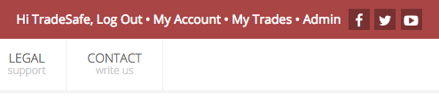
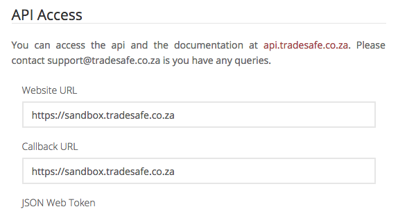

Creating your API Key
=====================

Once you have recieved notice that the API has been enabled, login and goto
**My Account**.

On your account settings page you will now see a new section called
**API Access**.

Fill in both the website url and :doc:`callback </callback>` url. You can use a
service like RequestBin for your callback url if your don't have one yet.

Once you have saved the page a JSON Web Token (`JWT <https://jwt.io/>`_) will be
generated for you.

.. note::

  If you change the **Website URL** and new token will be generated for your
  account. You can change the callback url at any time.
